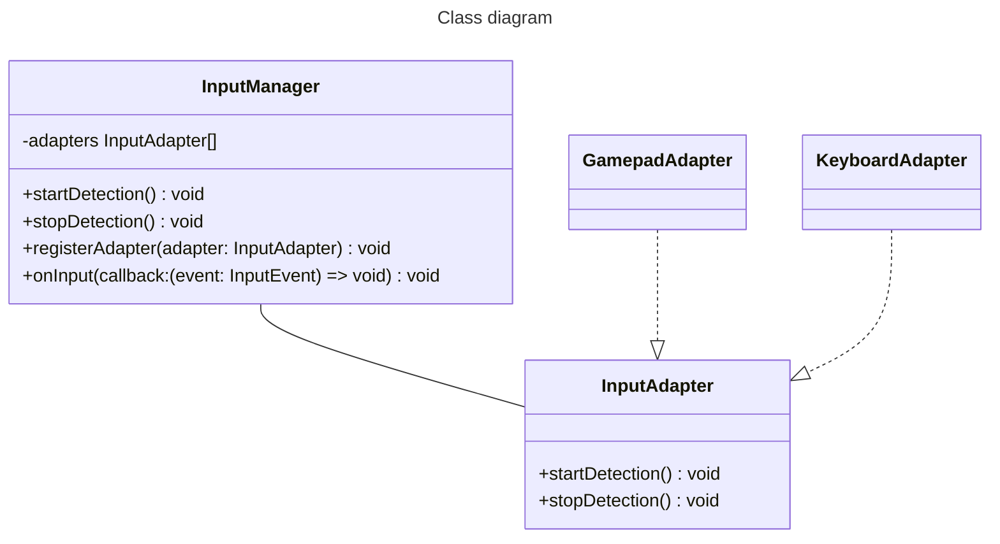

# NodeJS Input Research

This documents collects research about how to integrate different input variants (like gamepads or MIDI-controllers) into a NodeJS, more specifically an Electron, application.

## Research on how to implement input variants

### Gamepads

The web specification (W3C) defines a spec to interact with Gamepads. The Gamepad interface is exposed via the Gamepad Javascript API. The Gamepad API adds events to the Window object to read from several gamepads. Additionally, it introduces a Gamepad object, which allows to read the state of a Gamepad (for example pressed buttons). In contrast to the keyboard events that are exposed via events, reading the state of a Gamepad needs the be done manually in a "game loop". The API limits its scope to gamepads only, meaning it only knows simple button presses and axes movements.

The Gamepad API exposes two events on the Window object: `gamepadconnected` and `gamepaddisconnected`. Those events are fired if a new gamepad is connected to or disconnected from the computer.

Note: If a gamepad is already connected when visiting a page, the `gamepadconnected` event will be dispatched, if the user presses a button or moves an axis.

All currently connected gamepads can be read using the `Navigator.getGamepads()` function, that returns an array of Gamepad objects. Each Gamepad object has the following properties:

* id: A not strictly defined identifier that can be used to detect the device (for example the USB vendor and device id).
* index: Unique index in the array of gamepads.
* mapping: A string telling the developer, if the gamepads conforms to a known mapping. Right now there is only one standard mapping. This means if the browser can man the gamepad to the standard mapping, the string will be "standard".
* connected: A boolean indicating if the controller is still connected.
* buttons: An array of buttons that the controller has. Each entry of the list is a javascript object, containing the `pressed` property and the `value` property. The `pressed` property is a boolean that is true if the button is pressed by the user and false otherwise. The `value` property is a float between 0 and 1 which allows the API to support analog buttons.
* axes: An array of axes present on the device. Each entry is a float from -1 to 1.
* timestamp: A timestamp representing the last time, the data from the gamepad was updated.

To sample data from the Gamepad object, the `requestAnimationFrame()` method should be used to allow sampling gamepad inputs at the same sampling rate as animations on the page.

Which gamepads are supported could not be found (yet). However, we can assume that the chromium browser that powers Electron should support all major gamepads.

For reference see:
* [Gamepad API](#ref-gamepad-api)
* [Gamepad Specification](#ref-gamepad-spec)

### Other inputs

As mentioned above, the Gamepad API deliberately limits itself to gamepads with buttons and axes. To make access to other devices possible the W3C designed the WebHID API which can be used to access Human Interface Devices other than gamepads.

With this API one can request a specific device from the browser. If the device is connected one can add an event listener to the device object, which fires every time data was send from the device. This way it's possible to implement drivers for all devices that implement the HID protocol.

Additionally it might be possible to handle inputs from devices that do not support the HID protocol by using either the Web Bluetooth API, the Web Serial API or the WebUSB API.

All those APIs are supported by Electron. To use those APIs it's necessary to implement special events on the main process in Electron.

For reference see:
* [Accessing HID Devices on the Web With the WebHID API](#ref-webhid-paper)
* [Device Access - Electron](#ref-electron-device-access)

## Research on the current state of the TactileCollab project

### Input handling

Currently the TactileCollab project only supports keyboard inputs which exactly one key per configuration. Each configuration can trigger one to five actuators in a specific intensity. They can be configured after entering a room on the right side of the application. All configurations are saved in the configuration file and are loaded on application startup. This means that input configurations are persisted during launches of the program.

When adding a input configuration the user can input various details about the configuration, for example a name, the intensity and so on. Additionally, there is a button that starts scanning for keyboard inputs. On click, the button flips a component boolean attribute. The component has a `keydown` event handler that register key presses if the boolean attribute is true. If a button was pressed, the key will be displayed on the screen and scanning will be stopped. 

If the user saves the information by clicking the submit button, all entered data will be submitted to the `PlayGroundActionTypes.addButtonToGrid` store action. This action generates a unique id for the configuration, finds a free spot in the grid and submits the data via the `IPC_CHANNELS.main.saveKeyBoardButton` event to the IPC api. The IPC api persists the configuration into the configuration file. Finally, the state action submits the `PlayGroundMutations.ADD_ITEM_TO_GRID` action in the store which pushes the configuration to the current list of configurations in memory.

Each configuration is stored in an object of the `KeyBoardButton` interface. This interface contains the following attributes:

* `channels`: Array of actuators that should be triggered.
* `color`: The color of the configuration, which is used display the configuration in the application.
* `intensity`: The intensity in which the actuators should be triggered.
* `name`: The name of the configuration.
* `key`: The key that must be pressed (as a string).
* `isActive`: An object storing the current active state of the configuration (more on that later).
* `i`: The generated unique id.
* `x`: The x coordinate of the configuration in the grid.
* `y`: The y coordinate of the configuration in the grid.
* `w`: The width of the configuration in the grid (defaults to 1).
* `h`: The height of the configuration in the grid (defaults to 1). 

An input configuration can be used via two actions. The first option is to click on the configuration on the right hand side of the application. The second option is to use the key defined in the configuration. To ensure that the application knows if a configuration is active, the `isActive` object is used. It stores one boolean indicating whether the first option was used called `mouse` and another boolean for the second option called `keyboard`. 

The store provides two actions to activate and to deactivate a configuration called `PlayGroundActionTypes.activateKey` and `PlayGroundActionTypes.deactivateKey` respectively. Each action takes two booleans indicating which input option (mouse or keyboard) was used. 

The actions first retrieve the configuration by the passed key string. Afterwards it compares the `isActive` state of the configuration to the passed booleans. If the booleans match the action will do nothing. Otherwise it will update the `isActive` state of the configuration with the new booleans. If the configuration was not active before (meaning `mouse` and `keyboard` booleans in the `isActive` object are false) and one of the passed in booleans is true an activation event is emitted to the IPC api. For deactivation the configuration must have been inactive before and one of the passed booleans must be true. 

The IPC api handles the input, forwarding the action to the saved actuators and records the action if recording is currently active. It also uses the `key` string in the `updateIntensities` method of the `RoomModule`. 

### Installing TactileCollab on Ubuntu

#### Bluetooth

According to the [noble documentation](https://github.com/abandonware/noble#running-on-linux) we need to install some libraries related to bluetooth.

Also noble needs privileges that it can get by running the application with `sudo` or by setting the capabilities of the binary. In the documentation they advise to use `setcap` to set the capabilities of the `node` binary. However in the case of Electron apps this won't work, because Electron runs from its own binary (located in `node_modules/electron/dist/electron`). So we have to grant the capabilities to this binary instead:

```sh
sudo setcap cap_net_raw+eip <PATH_TO_REPO>/frontend/node_modules/electron/dist/electron
```

However, this messes up linking with shared libraries (this seems to be a Linux security feature). We can fix this by adding a custom config file to `/etc/ld.so.conf.d`. For example the file could be named `electron-node.conf` and has to contain the absolute path to the `dist` directory in which the Electron binary is located.

Afterwards, one has to reload the linker using

```sh
sudo ldconfig
```

Note: We will see how this works in the future but I imagine that one has to set the capabilities again, once we update the electron binary.

For reference see:
* [Noble documentation](#ref-noble-documentation)
* [Issue about Noble with Electron](#ref-noble-issue-comment)

## PoC: Implementing the Gamepad API in NodeJS

To show off how supporting gamepads would look like, a proof of concept (PoC) should be implemented. The PoC should make it possible to detect button presses and axes movements of all controllers available to the application. The PoC should be implemented as a simple Electron app.

The resulting program can be found in the `poc` folder of this git repository. It can be started using the following commands:

```bash
npm install && npm start
```

When opening, the user gets presented a simple screen telling them what to do in this program and the Developer Tools to see debug information.


After clicking on the "Detect" button the program tries to find connected controllers and display pressed buttons or moved axes per controller. Below is a screenshot of two controllers being simultaneously pressed.


When clicking on the "Scanning..." button again detecting of button presses will be stopped.

When the "Detect" button is clicked a scanning loop will be started using the `requestAnimationFrame` method, which indicates the browser, that the program wants to perform an animation (in this case displaying information on the screen if needed). This ensures that the scanning takes place at approximately the display refresh rate of the user, which is recommended when processing gamepad input. The end of the loop is controlled by a global `scanning` variable, that will be toggled if the user clicks the "Detect" button.

```js
const startScanning = (inputsOutput) => {
  if (!scanning) return;

  requestAnimationFrame(() => {
    ...
    startScanning(inputsOutput)
  })
}
```

In each iteration, the `navigator.getGamepads()` method gets called which returns an array of `Gamepad` objects. However some items in this array may be `null` indicating disconnected controllers, that should keep their index in the array.

```js
const connectedGamepads =
  navigator.
    getGamepads().
    filter(gamepad => gamepad !== null)
```

After checking for `null` the program iterates the buttons, filters for pressed buttons and stores them into a variable.

```js
connectedGamepads.forEach(gamepad => {
  const pressedInputs = []

  const pressedButtons =
    gamepad.
      buttons.
      map((button, index) => ({ index, button })).
      filter(config => config.button.pressed)

  pressedInputs.push(
    ...pressedButtons.map(buttonConfig => (
      {
        type: 'button',
        name: getButtonName(buttonConfig.index, gamepad.mapping),
        value: buttonConfig.button.value
      }
    )))
  ...
})
```

The program also maps the button index to a mapping name. This name is determined by the `mapping` attribute of the `Gamepad` object. If the attribute is `standard` the program looks up the name in a JavaScript array containing button mappings for a XBox controller. If the index is out of bounds of this array or if the `mapping` attribute is not `standard` the name is unknown. Those mappings does not seem to be publicly available (in form of a NPM library or a data sheet). The only thing that could be found is the [SDL_GameControllerDB](https://github.com/gabomdq/SDL_GameControllerDB) that could be used to generate button mappings for all controllers.

```js
const getButtonName = (buttonIndex, mapping) => {
  if (mapping !== "standard") return "unknown"
  return buttonMapping[buttonIndex] || "unknown"
}
```

After collecting all buttons, all used axes are collected. To avoid the axes being falsely identified as used only an absolute value bigger than 0.2 recognizes an axis as being in use. For a real application, this value may be adjusted or set according to the connected controller. Each axis also gets a name provided by the default mapping as explained above.

```js
const usedAxes =
  gamepad.
    axes.
    map((axis, index) => ({ index, axis })).
    filter(axisConfig => Math.abs(axisConfig.axis) > 0.2)

pressedInputs.push(
  ...usedAxes.map(axisConfig => (
    {
      type: 'axis',
      name: getAxisName(axisConfig.index, gamepad.mapping), value: axisConfig.axis
    }
  )))
```

Afterwards, all objects in `pressedInputs` are rendered into the view, using the gamepad name as a title above.

The name of each gamepad can be obtained by using the `id` attribute of the `Gamepad` object name. As the name suggests, this attribute does provide a human readable but not user friendly name of the connected gamepad. It might be possible to determine a better suited name by using the USB APIs provided via WebUSB or the USB node package. However, both of those approaches require more intensive setup and permissions. For example on most Linux distributions the program needs to ensure that a proper udev rule gets created when installing the program.

After trying out the PoC the following incomplete list of supported gamepads could be made:

| Device                                   | Ubuntu                                           | Windows                                               | MacOS (Intel)                                                                                                                                                     |
|------------------------------------------|--------------------------------------------------|-------------------------------------------------------|-------------------------------------------------------------------------------------------------------------------------------------------------------------------|
| XBox 360 wired controller                | :white_check_mark:                               | :white_check_mark:                                    | :negative_squared_cross_mark: (no native support, [3rd party drivers](https://github.com/360Controller/360Controller) deprecated starting with MacOS 11 Big Sur)  |
| XBox wireless controller                 | :white_check_mark: (after a firmware update)     | :white_check_mark: (same id as XBox 360 Controller)   | :white_check_mark:                                                                                                                                                |
| Nintendo Switch Pro Controller / Joycons | :negative_squared_cross_mark: (work in Firefox)  |                                                       |                                                                                                                                                                   |
| Sony Dualshock 4                         |                                                  |                                                       | :white_check_mark:                                                                                                                                                |                                                                                                                  |   |                                                       |   :white_check_mark:    |


## Expanding the input handling of TactileCollab

### Requirements

* Support one or more input devices.
* Support keyboards and gamepads.
* Support most used gamepads (XBox and PlayStation)
* Support detecting newly plugged in gamepads.
* Support multiple different gamepads.
* Support multiple same gamepads if possible.
* Store configured input bindings in a configuration file.

### Architecture


[//]: # "Add InputEvent type, add Configuration object that can be serialized and worked with containing Input + Action + Position in Grid, also the code is not class based yet so probably do not want to use classes as well? however they have two classes right? (most of those can be objects anyway)"

## Further Reading

* [Ha Dou Ken Music: Different mappings to play music with joysticks](https://www.researchgate.net/profile/Flavio-Schiavoni/publication/343797776_Ha_Dou_Ken_Music_Different_mappings_to_play_music_with_joysticks/links/5f403ad1a6fdcccc43e3e3ab/Ha-Dou-Ken-Music-Different-mappings-to-play-music-with-joysticks.pdf)
* [Web MIDI API](https://developer.mozilla.org/en-US/docs/Web/API/Web_MIDI_API)
* [joypad.js - JavaScript library that lets you connect and use various gaming controllers [...]](https://github.com/ArunMichaelDsouza/joypad.js)

## References

* <a name="ref-gamepad-api">Using the Gamepad API - MDN</a> - <https://developer.mozilla.org/en-US/docs/Web/API/Gamepad_API/Using_the_Gamepad_API>
* <a name="ref-gamepad-spec">Gamepad - World Wide Web Consortium (W3C)</a> - <https://w3c.github.io/gamepad>
* <a name="ref-webhid-api">Accessing HID Devices on the Web With the WebHID API - Thomas Steiner and François Beaufort</a> - <https://arxiv.org/pdf/2104.02392.pdf>
* <a name="ref-electron-device-access">Device Access - Electron</a> - <https://www.electronjs.org/de/docs/latest/tutorial/devices>
* <a name="ref-noble-documentation">noble Documentation - GitHub</a> - <https://github.com/abandonware/noble>
* <a name="ref-noble-issue-comment">Issue comment about noble with Electron - GitHub</a> - <https://github.com/noble/bleno/issues/282#issuecomment-341364657>
